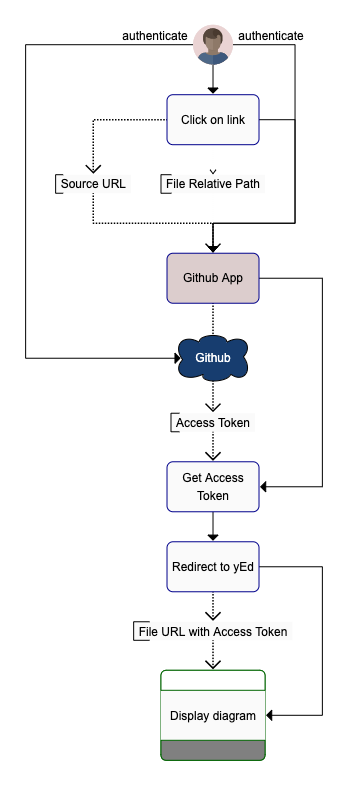

# 2. application workflow

Date: 2020-06-26

## Status

Accepted

## Context

[yEd live editor](https://www.yworks.com/yed-live) is designed to edit `.graphml` files.  It has the ability to load files from a url that is provided via the `file` url parameter.
However, if `.graphml` files are hosted in a private GitHub repository, the url will have to include an access token which is unique to the user.

The purpose of the application is to allow a user to open a `.graphml` file hosted in a private GitHub repository and have it open in the yEd live editor using a url that includes the Github access token.

## Decision

* We will use the GitHub API:  https://developer.github.com/v3/
* We will write the application for the Google Scripts platform: https://script.google.com
* The application will follow workflow outlined below

### Workflow

* The user will ultimately be redirected to the following url
  * https://www.yworks.com/yed-live/?file=${url}?token=${github_token}

## Consequences

* The application hosting will be free
* The application will have to be registered in Github
* Once installed, the application will be usable to anyone
